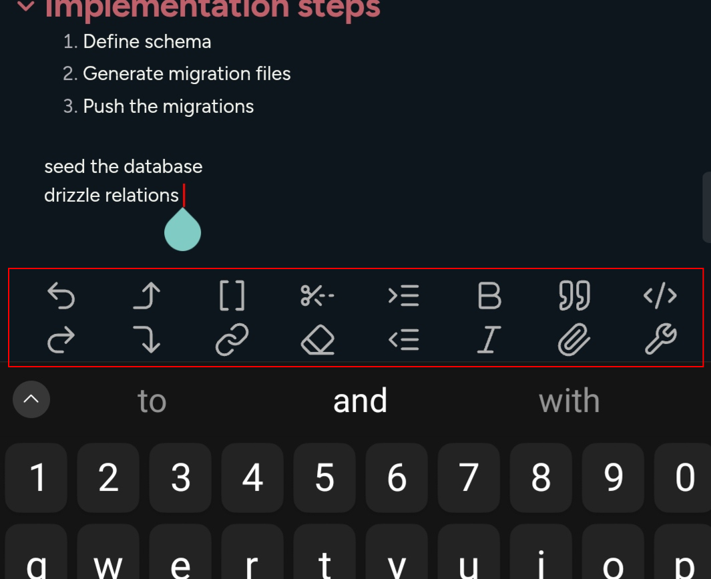

# Double row toolbar

Adds a second row to the Obsidian toolbar on mobile devices, allowing for more quick access buttons.

   
What the plugin do screenshot.

    
        
 

   
Recommended Toolbar.

    
        
 

   
How to add delete current line button.

   <ol>
    <li> Open a note and tap inside the editing area to show the toolbar.
    <li> Tap the `configure mobile toolbar` button.
    <li> Find `Double row toolbar : Delete current line` and add it to `Manage toolbar options`.
    <li> If you can't find it, scroll to the bottom. In the `Add global command` section, search for `Double row toolbar : Delete current line`.   
   </ol>

---

